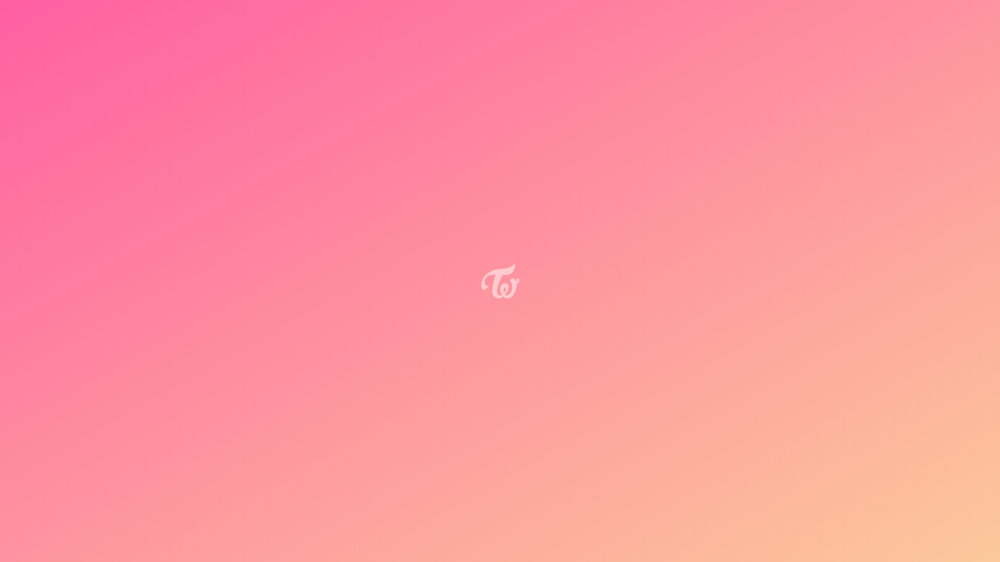
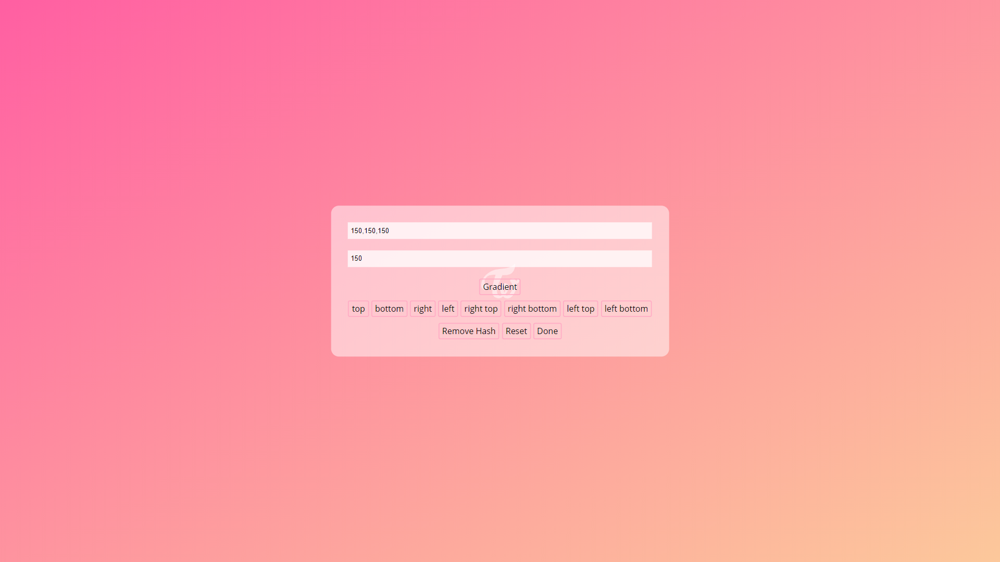
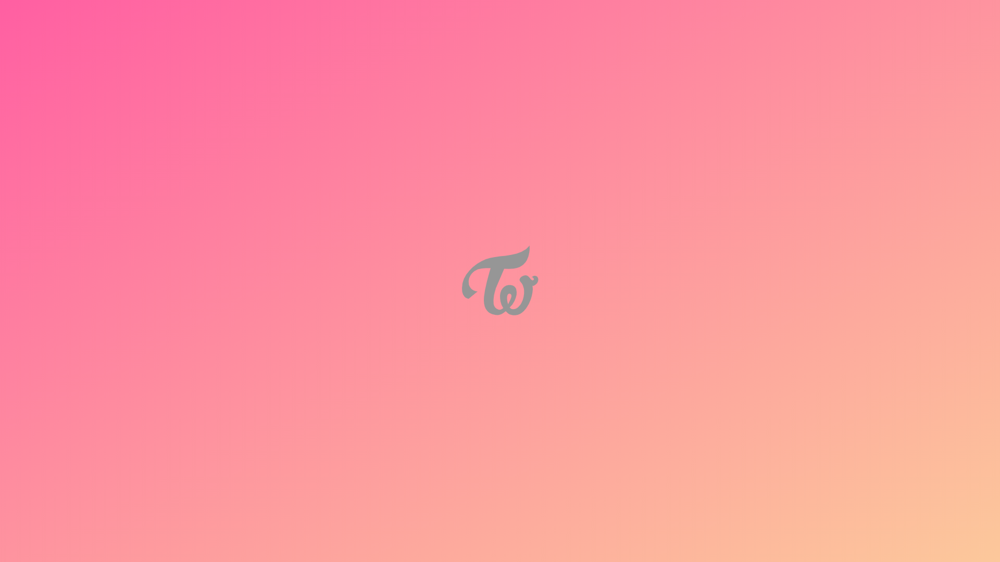
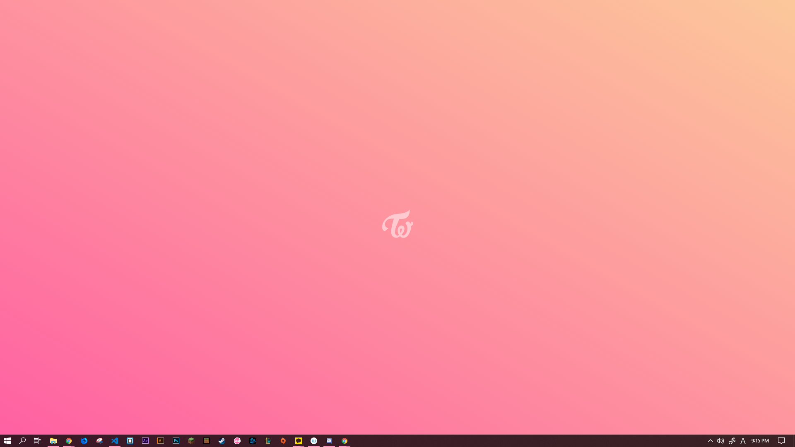
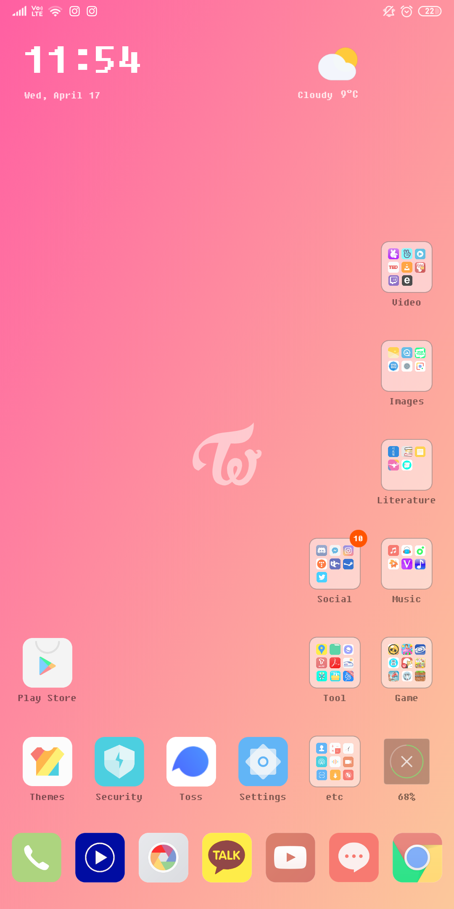

# Create background with TWICE logo and gradient

https://marshall-ku.github.io/twice-logo-background/

## How to use

Click anywhere to toggle full screen, and capture the page.

Then, you just can use it as your background.

If you are using desktop, press right click on the mouse to show this layer.
If you are using mobile devices, long press the page to show this layer.

Color - edit color of the logo (rgb or rgba)
Width - edit width of the logo
Gradient - edit gradient of "body"
Remove Hash - Reset all the settings
Reset - remove the value of all "input"
Done - the logo will be updated with the value that you entered

Done!

#### preview

